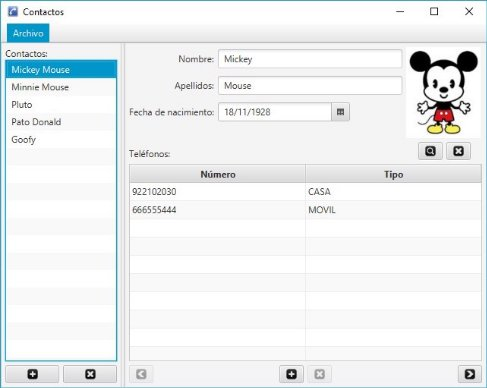
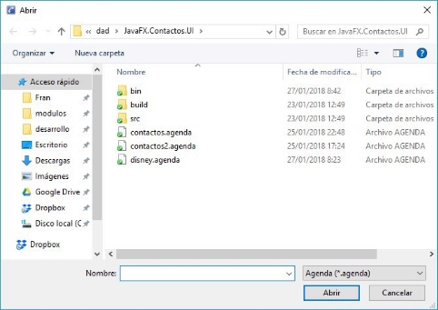
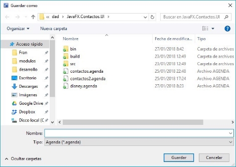
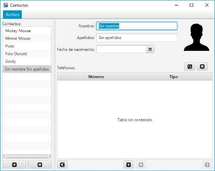
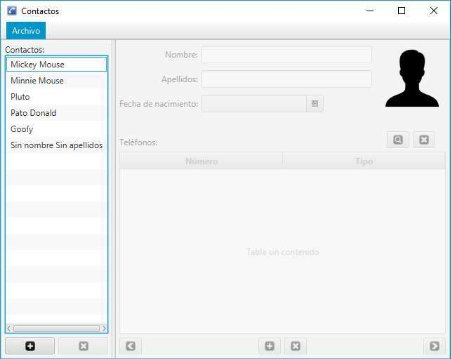
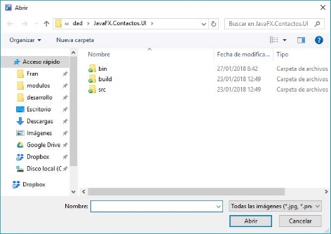

# GesCon

## Descripción 

Implementar una aplicación con GUI empleando el framework JavaFX que permita la gestión de una lista de contactos con sus números de teléfono, así como poder asociar una foto a los contactos para identificarlos rápidamente. 

Se  deberá  aplicar  el  patrón  de  diseño  **MVC**  (Modelo-Vista-Controlador), y  las  vistas deberán  implementarse en **FXML**. 

Así mismo, será posible guardar/abrir el modelo de beans FX en/desde un fichero XML con extensión `.agenda`. 

## Modelo de datos 

El modelo de datos que deberá gestionar  la aplicación es el siguiente: 


Las clases del modelo de datos serán provistas por el profesor en el paquete `dad.contactos.model`. 

### Ejemplo de uso del modelo de datos 

El siguiente código crea 1 contacto para Chuck Norris con su foto y 2 números de teléfono; luego crea una agenda, añade el contacto y guarda la agenda en un fichero: 

```java
File fichero = new File("fotos/Chuck_Norris.jpg");
Image imagen = new Image(fichero.toURI().toURL().toExternalForm());

Contacto c1 = new Contacto();
c1.setNombre("Chuck");
c1.setApellidos("Norris");
c1.setFechaNacimiento(LocalDate.of(1956, 3, 25));
c1.setFoto(imagen);
c1.getTelefonos().add(new Telefono("922102030", TipoTelefono.CASA));
c1.getTelefonos().add(new Telefono("666777888", TipoTelefono.FAX));

Agenda agenda = new Agenda();
agenda.getContactos().addAll(c1);
agenda.save(new File("contactos.agenda"));
```

## La interfaz de la aplicación 

La aplicación contará con una única ventana (Stage), que tendrá el siguiente aspecto: 



- Barra de menú  
- Panel "Contactos" (a la izquierda) 
- Panel "Detalles del contacto" (a la derecha) 
    - Los paneles anteriores estarán en un **SplitPane** (repartiéndose el espacio en 25%-75%). 


>    Puede implementarse con un único controlador y un único fichero FXML para la vista.  

### Barra de menú 

En la parte superior tendrá una barra de menú con el menú "Archivo": 


>   **NOTA:** Los iconos en las opciones del menú (MenuItem) se establecen igual que a los botones (añadiéndole un "ImageView") y las combinaciones de teclas son aceleradores (accelerators). Todo se puede indicar en el FXML. El separador es un "SeparatorMenuItem".

A continuación se explica lo que hace cada opción del menú: 

#### Nuevo

Se creará una nueva agenda y se sobreescribirá la anterior. 

Se deberá pedir confirmación antes de crear la agenda nueva con un diálogo como el siguiente: 


#### Abrir…

Se abrirá una agenda desde un fichero con extensión ".agenda". 

Se presentará un "FileChooser" para elegir el fichero a abrir: 



El "FileChooser" se deberá configurar de la siguiente forma: 

- Deberá tener dos filtros (ExtensionFilter):  
    - *Agenda (\*.agenda)* 
    - *Todos los archivos (\*.\*)* 

- Deberá tener el icono de la aplicación. 

Para abrir el modelo disponemos del método estático "Agenda.load(File fichero)". 

En caso de error, se mostrará un mensaje como el siguiente, que deberá incluir el mensaje de la excepción en el contenido: 


#### Guardar como…

Se guardará la agenda actual en un fichero ".agenda". 

Se abrirá un "FileChooser" para elegir el fichero a guardar: 



El "FileChooser" se deberá configurar de la siguiente forma: 

- Deberá tener dos filtros (ExtensionFilter):  
    - *Agenda (\*.agenda)* 
    - *Todos los archivos (\*.\*)* 

- Deberá tener el icono de la aplicación. 

Para guardar el modelo disponemos del método "save(File fichero)" de la agenda. 

En caso de error, se mostrará un mensaje (Alert) con la causa del error (mensaje de la excepción). 

### Panel "Contactos" 

En el panel de contactos se mostrará la lista de contactos de la agenda y se podrán añadir y eliminar contactos. 


Los botones de este panel hacen lo siguiente: 

#### Nuevo contacto 

Añade  un  nuevo  contacto  directamente  a  la  agenda  con  nombre  "Sin  nombre"  y  apellido  "Sin apellidos", y el resto de propiedades las dejamos con sus valores por defecto: 



Se deberá seleccionar automáticamente el nuevo contacto en la lista de contactos. 
- Esto provocará que se muestre en el panel de derecho los datos del nuevo contacto (ver "[Panel de Detalles del contacto](#Panel "Detalles del contacto")" más adelante). 

También se deberá poner el foco automáticamente en el cuadro de texto del "Nombre". Solicitar el foco se debe hacer de la siguiente forma. 

```java
Platform.runLater(() -> componente.requestFocus());
```

#### Eliminar contacto 

Elimina el contacto seleccionado de la lista.  

Se deberá pedir confirmación antes de hacerlo con un diálogo como el siguiente: 


Si no hay ninguno seleccionado deberá deshabilitarse.  

### Panel "Detalles del contacto"

Desde aquí podemos ver y editar los detalles del contacto seleccionado. 


Al seleccionar un contacto de la lista de contactos, se mostrarán sus datos en el panel de "Detalles del contacto" a la derecha (se "bindeará" el contacto): 


Si  no  hay  ningún  contacto  seleccionaddo  en  la  lista  de  contactos,  se  mostrará  el  paanel  de  la  derecha  sin  datos ("desbindeado" y vacío), y se deshabilitaará el panel para que no se pueda manipular ninguuno de sus componentes: 



>   NOTA: Cuando la foto del contacto es "null", se deberá mostrar en su lugar "no-photo-128x128.png", pero OJO, no es la foto del contacto, sino la  que se muestra. No deberá guardarse en el fichero.


**PISTA: bindeo utilizado para mostrar que no hay foto:**

```java
Image NO_PHOTO = new Image("no-photo-128x128.png"); 
ObjectProperty<Image> foto = new  SimpleObjectProperty<>(); 
[...] 
fotoView.imageProperty().bind(
    Bindings.when(foto.isNull())
    	.then(NO_PHOTO)
	    .otherwise(foto)
); 
```

>    `fotoView` es un `ImageView`. 

Los botones de este panel hacen lo siguiente: 

#### Poner foto 

Se cargará una foto desde fichero y se pondrá al contacto. 

Para ello se abrirá un "FileChooser" para elegir la foto a abrir: 



El "FileChooser" se deberá configurar de la siguiente forma: 

- Deberá tener dos filtros (ExtensionFilter):  
  - *Todas las imágenes (\*.jpg, \*.png, \*.bmp)* 
  - *Todos los archivos (\*.\*)* 
- Deberá tener el icono de la aplicación. 

Para cargar una foto : 

```java
Image foto = new Image(fichero.toURI().toURL().toExternalForm());
```

>   Donde fichero es de tipo "File". 

En caso de error, se mostrará un mensaje como el siguiente: 


#### Quitar foto 

Quita la foto del contacto (la pone a "null"). 

#### Nuevo teléfono 

Abre un diálogo personalizado o una ventana (Stage) para añadir un nuevo teléfono al contacto. 


>   Los elementos de la interfaz deberán presentar una disposición similar. No necesariamente se tiene que implementar con un diálogo personalizado.

El botón "Nuevo" se habilitará sólo si se ha especificado el "número de teléfono" y el "tipo". Al pulsarlo se añadirá el teléfono al contacto y se cerrará el diálogo (ventana). 

El botón "Cancelar" cerrará el diálogo (ventana) y no hará nada.

#### Eliminar teléfono 

Elimina el teléfono seleccionado de la tabla.  

Se deberá pedir confirmación antes de hacerlo con un diálogo como el siguiente: 


Si no hay ninguno seleccionado deberá deshabilitarse.  

#### Anterior

Se seleccionará en la lista del panel "Contactos" el contacto anterior (puedes usar el "selectionModel" del ListView de contactos). 

Si el actual es el primero de la lista, el botón se deshabilitará. 

**PISTA:  siendo  "contactos"  un  "ListProperty"  bindeado  a  la  lista  de  contactos  de  la  agenda, "primerContacto" contiene siempre el primer contacto de la lista.** 

```java
ObjectBinding<Contacto> primerContacto = Bindings.valueAt(contactos, 0);
```

>    Habrá que comprobar con un bindeo a "primerContacto" si el seleccionado es el primero para deshabilitar el botón. 
>
>   ```java
>   anteriorButton.disableProperty().bind(primerContacto.isEqualTo(contactoActual))
>   ```

#### Siguiente 

Se seleccionará en la lista del panel "Contactos" el contacto siguiente (puedes usar el "selectionModel" del ListView de contactos). . 

Si el actual es el último de la lista, el botón se deshabilitará. 

**PISTA:  siendo  "contactos"  un  "ListProperty"  bindeado  a  la  lista  de  contactos  de  la  agenda, "ultimoContacto" contiene siempre el último contacto de la lista.** 

```java
ObjectBinding<Contacto> ultimoContacto =  Bindings.valueAt(
    contactos, 
    Bindings.size(contactos).subtract(1)
);
```

>   Habrá que comprobar con un bindeo a "ultimoContacto" si el seleccionado es el último para deshabilitar el botón. 
>
>   ```java
>   siguienteButton.disableProperty().bind(ultimoContacto.isEqualTo(contactoActual))
>   ```

## Criterios de calificación 

|Criterios |Puntuación |
| - | - |
|Ventana principal > Diseño |5 |
|Opciones del menú > Nueva agenda |5 |
|Opciones del menú > Abrir agenda |8 |
|Opciones del menú > Guardar agenda |4 |
|Panel "Contactos" > Diseño |7 |
|Panel "Contactos" > Añadir contacto |3 |
|Panel "Contactos" > Eliminar contacto |4 |
|Panel "Detalles del contacto" > Diseño |10 |
|Panel "Detalles del contacto" > Editar los detalles |8 |
|Panel "Detalles del contacto" > Mostrar foto o "no-photo" cuando es nulo |6 |
|Panel "Detalles del contacto" > Poner foto |8 |
|Panel "Detalles del contacto" > Quitar foto |2 |
|Panel "Detalles del contacto" > Añadir teléfono |15 |
|Panel "Detalles del contacto" > Quitar teléfono |5 |
|Panel "Detalles del contacto" > Anterior contacto |5 |
|Panel "Detalles del contacto" > Siguiente contacto |5 |
|**Total** |**100** |

**El profesor determinará el grado de cumplimiento de cada apartado a partir de la ejecución de la aplicación, por lo que es sumamente importante que los apartados que queremos que puntúen se puedan probar.**
